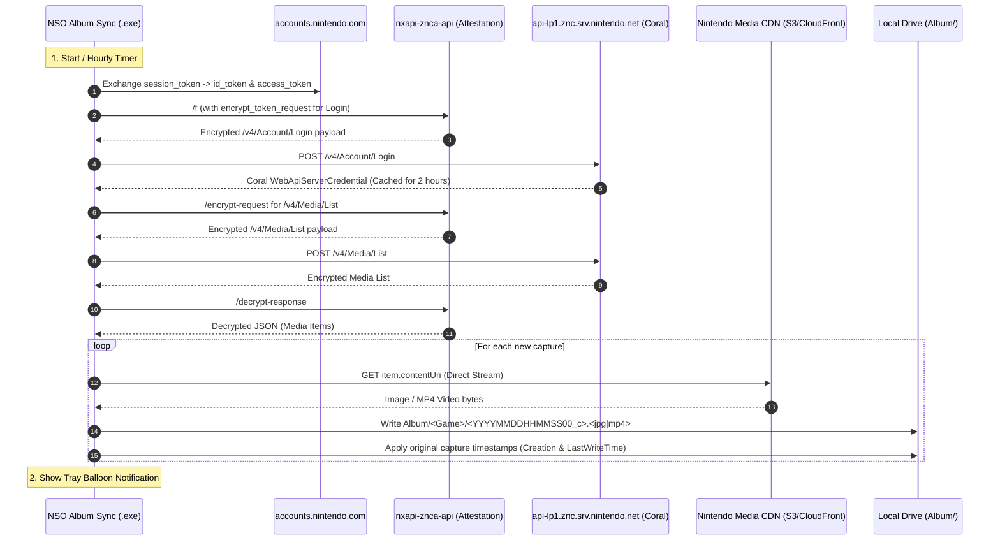

# NSO Album Sync 📸🎮

> **Automatic Nintendo Switch Online Album Synchronizer**
> A lightweight background application that lives in your System Tray and automatically downloads your Nintendo Switch Online screenshots and videos directly to your PC, following the **official Nintendo Switch USB folder structure**.

[](https://github.com/dycool/nso-album-sync/actions/workflows/build-release.yml)
[](LICENSE)
[](#)

---

## ✨ Features

- 🔄 **Hourly Background Auto-Sync**: Silently checks your Nintendo Switch Online album every hour and downloads newly uploaded screenshots and videos.
- 📁 **Official Nintendo Switch USB Structure**: Saves captures matching the exact file hierarchy used by the Switch USB PC transfer:
  ```text
  <Your Chosen Folder>/
  └── Album/
      ├── Super Smash Bros. Ultimate/
      │   ├── 2026081514300000_c.jpg
      │   └── 2026081515000000_c.mp4
      ├── The Legend of Zelda Tears of the Kingdom/
      │   └── 2026081512100000_c.jpg
      └── Mario Kart 8 Deluxe/
          └── 2026081511050000_c.jpg
  ```
- 🕒 **Preserves Original Timestamps**: Automatically sets the local file creation and last modified timestamps to match the exact moment the screenshot/video was captured on your console.
- 🖥️ **Zero-UI System Tray App**: No console windows, no complex menus. Sits quietly in your system tray (bottom-right on Windows taskbar) with a native context menu:
  - 🔄 **Sync Now** — Trigger an immediate album sync on demand.
  - ⏱ **Auto-Sync (Hourly)** — Enable or disable automatic hourly checks.
  - 📁 **Select Folder...** — Change where your album captures are saved.
  - 📂 **Open Album Folder** — Open Windows Explorer directly to your album.
  - 🚀 **Start on Boot** — Toggle automatic launch on Windows startup.
  - 🔑 **Sign In / Sign Out** — Switch or manage your Nintendo Account.
  - ❌ **Exit** — Close the background application.
- 🔔 **Native Balloon Notifications**: Pops a subtle tray notification whenever new captures are synced.
- ⚡ **Zero Dependencies**: Standalone single-file `.exe` compiled with .NET 8 self-contained runtime. Requires no installation, no .NET runtime, and no Node.js.
- 🛡️ **`nxapi-znca-api` Compliant**: Strictly follows all open-source community guidelines, including 2-hour session caching, dynamic version discovery, combined `/f` attestation, and rate-limit backoff.

---

## 🚀 Getting Started

### 1. Download
Grab the latest `nso-album-sync.exe` from the [**Releases**](https://github.com/dycool/nso-album-sync/releases) page.

### 2. First Run (Sign-In Once)
1. Double-click `nso-album-sync.exe`.
2. A one-time sign-in dialog will appear:
   - Click **"🌐 1. Open Nintendo Sign-In Page"** to open Nintendo's official login page in your default browser.
   - Sign in to your Nintendo Account.
   - Right-click (or copy link) on the **"Select this person"** button (or copy the callback URL from your browser's address bar).
   - Paste the link into the app and click **"✅ Sign In & Connect"**.
3. That's it! Your session is stored securely in `%APPDATA%\NSOAlbumSync\config.json`.

### 3. Background Syncing
- The app will minimize to your System Tray and perform an immediate sync.
- It will automatically refresh every hour in the background.
- To sync manually at any time, right-click the tray icon and click **"Sync Now"**.

---

## 🛠️ System Tray Menu

| Menu Item | Action |
|---|---|
| **● Connected (Nickname)** | Displays current connection state and Nintendo account name |
| **Last sync: HH:mm** | Displays timestamp of the last successful sync cycle |
| **🔄 Sync Now** | Manually triggers an immediate scan and download |
| **⏱ Auto-Sync (Hourly)** | Toggles the 60-minute automatic background sync timer |
| **📁 Select Folder...** | Opens a folder picker to choose your album save directory |
| **📂 Open Album Folder** | Launches Windows Explorer directly inside your `Album` directory |
| **🚀 Start on Boot** | Adds/removes the app from Windows startup registry |
| **🔑 Sign In / Sign Out** | Re-authenticate or switch Nintendo accounts |
| **❌ Exit** | Completely exits the background application |

---

## 🏗️ Architecture & Network Flow



---

## 💻 Building from Source

### Prerequisites
- [.NET 8.0 SDK](https://dotnet.microsoft.com/download/dotnet/8.0) or higher.

### Build & Run
```bash
# Clone repository
git clone https://github.com/dycool/nso-album-sync.git
cd nso-album-sync

# Build debug version
dotnet build

# Publish single-file self-contained Windows executable
dotnet publish -c Release -r win-x64 --self-contained -p:PublishSingleFile=true -o ./publish
```

The resulting `nso-album-sync.exe` in `./publish` is a standalone binary with zero external dependencies.

---

## 🔒 Privacy & Security

- **Direct Connections**: All account tokens, media lists, and files are transferred directly between your machine and Nintendo's official endpoints over HTTPS.
- **Local Storage**: All credentials and sync histories are stored exclusively on your local machine (`%APPDATA%\NSOAlbumSync\`).
- **No Third-Party Tracking**: No telemetry, analytics, or user data is collected.

---

## 📜 Disclaimer

This application is an independent, open-source project and is not affiliated with, endorsed by, or associated with Nintendo Co., Ltd. or Nintendo of America Inc. Nintendo Switch and Nintendo Switch Online are trademarks of Nintendo.
